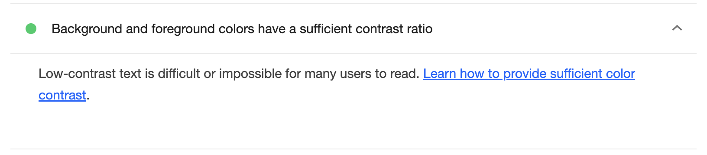

# Sailing to Inclusivity: An Accessibility Audit of Pirate-a11y

## Introduction

In today's digital age, web accessibility is not just a moral obligation—it's a necessity. With over 101 million internet users in the EU alone having disabilities, ensuring your website is accessible can significantly expand your reach and enhance user satisfaction. Accessibility is about creating an inclusive online environment where everyone, regardless of their abilities, can interact seamlessly with your content. This principle aligns closely with SEO best practices, as both aim to improve user experience by making websites more navigable and content more understandable. 

Adhering to accessibility standards like the Americans with Disabilities Act (ADA), Web Content Accessibility Guidelines (WCAG), and the W3C's guidelines is vital not just for compliance, but also for optimizing user experience and enhancing SEO performance. The WCAG guidelines, for instance, emphasize principles such as Perceivable, Operable, Understandable, and Robust (POUR), which resonate with SEO's focus on structuring content for both users and search engines. Proper heading structures and alt text not only aid screen readers but also improve content discoverability because they're valuable to SEO. By following these standards, not only do you meet legal requirements, but you also boost your website's user engagement, lower bounce rates, and increase your search engine rankings. Crafting a site with an inclusive design ensures you cater to a broader audience while enhancing your digital presence and brand reputation.

## Available Resources

- [Accessibility Presentation](https://www.figma.com/deck/Q5ldzu0ealaSDBXk47ENMH/Sailing-to-Inclusivity%3A-An-Accessibility-Audit-of--Pirate-a11y?node-id=1-346&node-type=slide&viewport=-6799%2C-121%2C0.62&t=ammQvcRP0KF5ZpLE-1&scaling=min-zoom&content-scaling=fixed&page-id=0%3A1)

## Methodology

To conduct a comprehensive accessibility evaluation of this website, I implemented a methodology involving both manual and automated testing techniques. This approach was guided by the Web Content Accessibility Guidelines (WCAG) standards to ensure a thorough analysis and actionable insights.

### Manual Review Process

1. **Keyboard Navigation:**
   - Using only a keyboard, we navigated the website to test the effectiveness of focus management and navigation order. Our objective was to ensure that all interactive elements were accessible and adequately highlighted upon focus.

2. **Screen Reader Testing:**
   - We employed the VoiceOver screen reader to analyze the site's content for logical reading order and effective descriptions, guaranteeing that users relying on auditory feedback could navigate and comprehend website information successfully.

3. **Color Contrast and Text Size:**
   - The WebAIM's Contrast Checker was used to measure the contrast ratios of text against background colors. We identified low contrast issues, particularly with body text and gray sections, along with evaluating text size adequacy for improved legibility.

4. **Layout Responsiveness:**
   - With developer tools, we examined how the website's layout adjusted across different screen sizes and orientations. Issues were found with the grid breaking below viewport widths of 991px, necessitating responsive adjustments.

### Automated Testing Tools

1. **Wave by WebAIM:**
   - This browser extension was used to uncover markup errors, missing alternative text, and further accessibility issues, providing a comprehensive diagnostic of the site's compliance with accessibility guidelines.

2. **Lighthouse Audit:**
   - Conducted within Google Chrome, Lighthouse provided a quantitative accessibility score and identified opportunities for improvement, as showcased in the attached report, which highlighted a score of 82 in accessibility metrics.

### Code Review

1. **Semantic HTML:**
   - The HTML was meticulously reviewed for the use of semantic tags such as `<header>`, `<article>`, and `<nav>`. Proper structure contributes significantly to the navigability and understanding of the website’s content by assistive technologies.

2. **ARIA Practices:**
   - We confirmed that ARIA roles and properties were implemented effectively without redundancy, ensuring enhanced interactions for users leveraging assistive devices.

3. **Form Elements:**
   - Forms were evaluated to ensure that labels were correctly associated with inputs, promoting ease of use and correctness when interacted with using assistive technologies.

### Tools and Techniques Used

- **Manual Testing Tools:** Keyboard, VoiceOver, and Contrast Checker.
- **Browser Extensions:** Wave by WebAIM and Lighthouse.
- **Development Tools:** Browser Developer Tools for layout and responsiveness testing.

This structured methodology ensured a comprehensive assessment, identifying key areas for improvement and setting the framework for a more accessible and inclusive web experience for all users.

## Detailed Findings & Recommendations

### **Introduction**

In this section, we delve into a detailed analysis of the accessibility issues identified during our evaluation of the website, focusing on the four key accessibility principles outlined by the WCAG: Perceivable, Operable, Understandable, and Robust. Each subsection addresses specific issues discovered under these principles, providing detailed descriptions, the standards violated, and actionable recommendations including code snippets to resolve the issues. My goal is to enhance the website's accessibility, ensuring it provides a seamless and inclusive user experience for all visitors, regardless of their abilities.

### **Perceivable: Contrast Issues**

#### **Introduction to Contrast Issues**

One of the primary areas where the website falls short of accessibility standards is in the contrast ratios between text and background elements, which affects the perceivability of content for users with visual impairments. According to WCAG 2.1, adequate contrast is crucial to ensure that text is legible for users with low vision or color deficiencies.

#### **Description of the Problem**

During our evaluation, I identified multiple areas where the contrast ratio between text and its background did not meet recommended levels. This issue is most notable in the body text and sections with gray backgrounds, where contrast ratios were as low as 2.69:1—far below the WCAG 2.1 minimum of 4.5:1 for normal text.

Key WCAG standards for color contrast:

- **[SC 1.4.3 – Contrast (Minimum) (Level AA):](https://www.w3.org/WAI/WCAG22/Understanding/contrast-minimum)**
  - Text and images of text should have a contrast ratio of at least 4.5:1.
  - Large-scale text (24px/18pt or 19px/14pt bold and larger) needs a ratio of at least 3:1.
  - Exceptions: inactive UI components, pure decoration, invisible text, or text in images with significant other visual content.
  - Logos and brand names are exempt from this requirement.
- **[SC 1.4.6 – Contrast (Enhanced) (Level AAA):](https://www.w3.org/WAI/WCAG22/Understanding/contrast-enhanced.html)**
  - Normal text and images of text require a higher contrast ratio of at least 7:1.
  - Large-scale text needs a ratio of at least 4.5:1.
  - The same exceptions apply as in SC 1.4.3.
- **[SC 1.4.11 – Non-text Contrast (Level AA):](https://www.w3.org/WAI/WCAG22/Understanding/non-text-contrast.html)**
  - User interface components and graphical objects need a contrast ratio of at least 3:1 against adjacent colours.
  - This applies to visual information needed to identify UI components and states, except for inactive components or those controlled by the user agent.
  - For graphics, this applies to parts required to understand the content, unless a particular presentation is essential to the information.

#### **How to Fix the Problem**

I approached the design by simplifying and unifying the color palette, making adjustments more manageable with CSS custom variables. This approach allowed us to maintain the design's essence while enhancing accessibility. For the gray background sections, we opted to keep the background color unchanged but employed a darker text color to increase contrast.

The changes have been implemented and can be reviewed in commit: [`c5403c3`](https://github.com/yaxchemanrique/pirate-a11y/commit/c5403c327765270a8c79fe5e443a11879d2657bd)

#### **Recommendations**

- **Review and Adjust Color Scheme:** Conduct a comprehensive review of the website's color scheme, utilizing tools like the WebAIM Contrast Checker to verify compliance with WCAG guidelines.
- **Implement Dynamic Contrast Checks:** Consider incorporating CSS variables or a theming system to facilitate dynamic contrast adjustments, allowing for consistent accessibility across various site elements and themes.

#### **Screenshots and Examples**

The screenshot below displays the Lighthouse report's assessment after making this contrast changes. It shows that the section on "Background and foreground colors have a sufficient contrast ratio" has passed, indicating that adequate contrast has been achieved. This compliance ensures that low-contrast text, which is a challenge for many users, is no longer an accessibility barrier.



### **Perceivable: Text Size**

#### **Introduction to Text Size Issues**

Text size is a crucial factor in ensuring content is perceivable for all users, especially those with visual impairments. Text that is too small can present significant challenges for users who rely on screen magnification or have difficulty reading small fonts. My analysis uncovered areas where the text size on the website does not meet accessibility standards, impacting the readability of the content.

#### **Description of the Problem**

The default body text on the website was identified to be `13px`, which is below the generally recommended minimum for legibility. Such small sizes may not accommodate users who lack the technical means to resize text effectively. While ideal font size can vary, a baseline of `16px` for regular text and `24px` for larger text is typically suggested.

#### **What WCAG says about font size**

The Web Content Accessibility Guidelines recommend the incorporation of ‘scalable’ text, meaning the [users should be able to resize the text](https://www.w3.org/TR/UNDERSTANDING-WCAG20/visual-audio-contrast-scale.html) up to 200% using standard browser features without losing any content or functionality. While these guidelines don’t prescribe a specific font size, adjustments should be tailored to each specific website's needs.

#### **How to Address This Problem**

- Text sizes below `13px` were changed to relative units `1rem`, facilitating better scalability.
- Due to Bootstrap setting the HTML base font-size to `10px`, we adjusted our CSS to ensure scalability with user preferences:

```css
html,
body {
   font-size: 1rem;
}
```

- This change ensures text hierarchy remains clear, with headings increased in size proportionally.
- For spacing adjustments around text, I employed `em` units, while `rem` units were used for block elements, creating a "zoomed in" effect when browser settings are changed.
- The only exception made was maintaining the copyright section at a smaller size of `0.875rem`.

To enhance text readability site-wide, I also recommend increasing base font size and optimizing for the use of relative units to allow for effective resizing by users. Here's a simplified example of our CSS modification:

```diff
html {
+ font-size: 1rem;
}

body {
- font-size: 13px;
+ font-size: 1rem;
}
```

These changes have been implemented in commit [`bb885c8`](https://github.com/yaxchemanrique/pirate-a11y/commit/bb885c8554acbb8e01880371199d428ea41633b4), capturing all the adjustments made to address text size issues comprehensively.

#### **Screenshots and Examples**


Demonstrates the prior state of the website, where changing browser settings did not affect text size.


Shows the current website post-modification, highlighting adaptive text size changes according to user preferences, achieving a "zoom effect."


Illustrates that browser zoom still works, complying with WCAG requirements of allowing text to be resized up to 200%.

### **Perceivable: Target Size**

#### **Introduction to Target Size Issues**

Ensuring adequate target size for interactive elements is crucial for making the website accessible to users with motor impairments. This includes providing sufficiently large clickable areas for links, buttons, and other controls. According to WCAG 2.2, the minimum size for pointer input targets should be 24 by 24 CSS pixels, ensuring ease of activation without accidentally triggering adjacent targets.

#### **Description of the Problem**

The website originally had small clickable areas for interactive elements, such as links and buttons, with many targets falling below the recommended minimum size. This poses significant challenges for users with dexterity limitations, making it difficult to precisely activate small controls.

#### **What WCAG says about Target Size**

The Web Content Accessibility Guidelines (WCAG) 2.2 specify that the size of the target for pointer inputs should be at least 24 by 24 CSS pixels, except under certain conditions:

- **[SC 2.5.8 – Target Size (Minimum) (Level AA):](https://www.w3.org/WAI/WCAG22/Understanding/target-size-minimum.html)**
  - This criterion requires that targets meet a minimum size of `24px` by `24px`.
  - Exceptions include spacing, equivalency, inline targets, user agent control, and essential presentations.

#### **How to Address This Problem**

- **Ensuring Minimum Size:** We set the target sizes to be at least 24 CSS pixels in height and width, or equivalently in relative units. For instance, links and buttons were adjusted to have a minimum size of `1.75rem` (which translates to 24px given a base font size of 14px).
  - For mobile devices, icons were sized at `3rem` (48px) to increase touch accuracy.
  - A media query (`@media (hover: none)`) was added to ensure mobile-specific styling.

```css
.social-media-links i {
   font-size: 1.75rem; 
}

@media (hover: none) {
   .social-media-links i {
      font-size: 3rem;
   }
}
```

These changes can be reviewed in commit [`2161892`](https://github.com/yaxchemanrique/pirate-a11y/commit/21618921b3c7a2d767ba15d4abf7c132b04ea267).

#### **Recommendations**

- **Review and Adjust Target Sizes:** Conduct a comprehensive review of all interactive elements to ensure they meet or exceed the minimum size requirements of WCAG.
- **Consider Spacing:** In cases where increasing size is not feasible, ensure sufficient spacing between targets to prevent accidental activation.

#### **Screenshots and Examples**


Demonstrates the previous website state with undersized interactive elements, with dimensions of `13px` x `15.5px`, showcasing the challenge of precise activation.


Shows the current website with updated target sizes, with dimensions of `28px` x `31.09px`, depicting how clicking and tapping are now more precise and user-friendly.

### **Perceivable: Link Accessibility**

#### **Introduction to Link Accessibility Issues**

In ensuring a seamless and user-friendly experience, it's vital that links are accessible and understandable to all users, including those who depend on screen readers or keyboard navigation. Links should be more than merely functional; they should provide clear, descriptive text and cues to communicate purpose and destination effectively.

#### **Description of the Problem**

Previously, the website had social media links and navigation elements that lacked proper labeling, along with images in links that didn't provide adequate information for screen reader users. There were also issues with non-descriptive link text and links that didn't appear as clickable elements due to insufficient visual cues such as underlining.

#### **What WCAG says about Link Accessibility**

The Web Content Accessibility Guidelines (WCAG) emphasize the importance of clear and descriptive links that allow users to discern their purpose and destination. According to WCAG:

- **Links must have meaningful text** to assist users in identifying the link's function and destination.
- **Visual and focus indicators** (e.g., underlining and color for links) should be used to ensure links are easily recognizable.
- **ARIA labels** can provide context and assistive information to screen reader users..

#### **How to Address This Problem**

To improve the accessibility of links site-wide, the following changes were implemented:

- **Social Media Links:** Enhanced with ARIA labels and hidden screen reader text to convey context, while icons are marked as decorative through `aria-hidden`.

``` html
<ul class="social-media-links">
   <li>
      <a href="https://www.facebook.com/LevelAccessA11y/" aria-label="Facebook">
         <i class="fab fa-facebook" aria-hidden="true"></i>
      </a>
   </li>
   <!-- Other social media links follow the same pattern -->
</ul>
```

- **Navigation Menu:** Improved the navigation menu by incorporating appropriate ARIA roles and attributes, following the [menu button pattern provided by WAI](https://www.w3.org/WAI/ARIA/apg/patterns/menu-button/examples/menu-button-links/). This enhancement enables smoother interaction for screen readers and keyboard navigation, utilizing focus indicators to highlight active elements. The focus indicators were designed to maintain visibility in different system settings, ensuring usability across a broad spectrum of contexts.

- **Article Cards:** Transitioned from using `<div>` tags on the `.thumbnail` classes to `article`, aligning better with semantic HTML practices. Instead of using separate links for images and titles in each article card, the link for the article title was expanded to cover the entire card, except for the descriptive text. This change supports both user navigation and the ability to highlight content, enhancing accessibility without sacrificing interaction.

- **Email Links in Footer Table:** Updated the email link representation in the footer table to display the full email address rather than using the generic "Email" text. This adjustment enhances link clarity and context, ensuring users receive specific information about the action associated with the link.

```diff
<tr>
   <td>Kevin</td>
   <td>
-      <a href="mailto:kevin.murphy@levelaccess.com">Email</a>
+      <a href="mailto:kevin.murphy@levelaccess.com">
+         kevin.murphy@levelaccess.com
+      </a>
   </td>
</tr>
```

- **Visual Link Styles:** Ensured text links are underlined and colored blue to clearly denote them as interactive elements, complying with common web conventions for links.

These changes can be reviewed in commit [`5dd2b98`](https://github.com/yaxchemanrique/pirate-a11y/commit/5dd2b981b37fb5461d7b48628be321c35a7faf42).

#### **Recommendations**

- **Consistent Use of ARIA Labels:** Continuously review icon-based links and ensure they have informative ARIA labels to aid screen reader users.
- **Standardize UI Elements:** Maintain visual consistency for all interactive elements to reinforce usability and predictability.

### **Operable: Skip to Main Content Link**

#### **Introduction to Skip to Content Links**

Navigating through repetitive menus and headers to reach the desired page content is a common hurdle, particularly for users relying on screen readers or keyboard navigation. 'Skip to main content' or 'Skip navigation' links serve as valuable shortcuts, allowing users to bypass cumbersome navigation elements and directly access the primary content of a webpage. Strategically positioned before the main navigation menu, these links provide a more streamlined browsing experience.

#### **Importance and Implementation**

Incorporating 'Skip to Main Content' links offers numerous benefits:

- **Enhanced Navigation:** By allowing users to skip past navigation and jump directly to content, these links improve the website's usability for keyboard-only and screen-reader users.
- **Time Efficiency:** They save users time and reduce the frustration associated with navigating through repetitive elements.
- **Compliance with WCAG:** Meets Web Content Accessibility Guidelines, supporting a wider audience by making content more accessible.

Here's how to manually implement a 'Skip to Main Content' link:

```html
<body>
   <a href="#main-content" id="skip-link">
      Skip to main content
   </a>
   <header class="site-header">
      <!-- Navigation and other header content -->
   </header>
   <main id="main-content">
      <!-- Main content -->
   </main>
</body>
```

#### **How to Implement the Solution**

To ensure the link is both invisible to sighted users until needed and accessible when focused:

```css
#skip-link {
   clip: rect(1px, 1px, 1px, 1px);
   word-wrap: normal;
   border: 0;
   clip-path: inset(50%);
   height: 1px;
   margin: -1px;
   overflow: hidden;
   padding: 0;
   position: absolute;
   width: 1px;
   z-index: 101;
}

#skip-link:focus {
   background-color: var(--clr-neutral-50);
   color: var(--clr-success-600);
   font-weight: 600;
   font-size: 1.5rem;
   padding: 0.8em;
   border: var(--clr-success-600) solid 3px;
   border-radius: 5px;

   clip: auto;
   clip-path: inherit;
   height: auto;
   top: 0.5rem;
   left: 0.5rem;
   margin: auto;
   overflow: auto;
   transition: 0s;
   width: auto;
}
```

This CSS styling ensures:

- The link is hidden off-screen by default.
- When focused, the link moves into view at the top left, marked by clear formatting and contrast, so keyboard users can easily interact with it.

The changes have been implemented and can be reviewed in commit: [`e2f63f9`](https://github.com/yaxchemanrique/pirate-a11y/commit/e2f63f9c043621c319a21bc4c2c8b9cedc090320)

#### **Best Practices**

- **Placement:** Position the 'Skip to main content' link as the first element inside the `<body>` tag to ensure immediate accessibility.
- **Visibility:** Update styles to ensure visibility when focused, aligning with WCAG standards.

### **Understandable: Improving Form Accessibility**

#### **Introduction to Form Accessibility Issues**

Forms are integral to many web interactions, yet they often present barriers for users, particularly those reliant on assistive technologies. Poorly implemented forms can hamper usability, leading to user frustration and decreased accessibility. This section outlines revisions to enhance form accessibility and usability on the site.

#### **Description of the Problem**

**Previous Form Accessibility Challenges:**

- **Disconnected Labels:** Labels were not properly associated with their respective input fields, making it difficult for screen readers to communicate form controls accurately.
- **Required Indicators:** Input fields marked with an asterisk (*) did not convey their necessity, as the labels were not connected, and there were no instructions explaining the asterisk's meaning.
- **No Feedback Mechanism:** The forms lacked detailed error or success feedback, relying heavily on color which could be problematic for users with color vision deficiencies.

**Login Form Issues:**

- **Inadequate Labeling:** The use of placeholders as labels posed usability issues. Placeholders disappeared upon user interaction, potentially confusing users about the input's purpose.
- **Lack of Descriptive Attributes:** The absence of autocomplete attributes hindered efficiency and form context.

#### **What WCAG Says About Forms**

The WCAG provides guidance on [best practices for form accessibility](https://www.w3.org/WAI/tutorials/forms/), which includes the following key elements:

- **Labeling Controls:** All form controls should be identified using the `<label>` element. In specific cases, additional mechanisms like WAI-ARIA or the title attribute may be used to enhance identification.

- **Form Instructions:** Provide clear instructions that help users understand how to complete the form and interact with individual controls effectively.

- **Validating Input:** Implement input validation and offer users options to undo changes or confirm data entry, ensuring clarity and preventing errors.

- **User Notifications:** Notify users about task completion, errors, and provide guidance on correcting mistakes.

#### **How to Address These Problems**

**Current Form Enhancements:**

- **Label and Input Association:** Clear association between labels and inputs were established using the `for` attribute, connecting them via matching `id` attributes.

```html
<form>
   <div class="form-group">
      <label for="firstName">
         First Name
         <span aria-hidden="true">*</span>
      </label>
      <input
         type="text"
         id="firstName"
         name="firstName"
         required
      />
   </div>
</form>
```

- **Required Field Instructions:** Instructions precede the form, clearly specifying that fields marked with an asterisk are required.

```html
  <p class="form-instructions">All fields marked with an asterisk (*) are required</p>
```

**Future Improvements:**

- **Feedback Through Pseudo-classes:** Utilize `:user-invalid` and `:user-valid` pseudo-classes for visual cues while ensuring not to rely solely on color.

- **Error Messaging:** Introduce detailed error messages for form inputs.
  
- **Color Considerations:** Ensure that error and success states do not rely solely on color differences, addressing potential issues for colorblind users.

**Login Form Adjustments:**

- **Semantic Labels:** Replaced placeholders with visible, descriptive labels, aiding clarity even after user interaction.

- **Autocomplete Enhancement:** Added `autocomplete` attributes to establish context and improve form usability:

```diff
<input
   type="text"
   id="ad"
   name="ad"
+  autocomplete="given-name"
/>
```

- **Button Accessibility:** Enhanced button with text to accompany the icon, ensuring clearer intent and action:

```diff
<button type="submit" class="login-button">
-    <i class="fas fa-chevron-right"></i>
+    <i class="fas fa-chevron-right" aria-hidden="true"></i>
+   <span class="sr-only">Login</span>
</button>
```

- **Input Distinction:** Modified input background colors to differentiate them from the form background, improving visual clarity.

These changes can be reviewed in commit [`f202eff`](https://github.com/yaxchemanrique/pirate-a11y/commit/f202efffb46df9f191dc0121100605c86f5f5514).

#### **Recommendations**

- **Consistent Feedback Mechanisms:** Implement consistent error and success messages across all forms, combining text and visual cues.
- **Future Button Text Addition:** Plan to add clear and descriptive text to buttons to provide users with explicit guidance.

### **Understandable: Enhancing Modal Accessibility**

#### **Introduction to Modal Accessibility**

Modals are a popular feature in modern web interfaces, serving as attention-grabbing dialogs for tasks like login prompts and content notifications. However, they can present accessibility challenges for users relying on assistive technologies or keyboard navigation. Proper implementation using semantic HTML, ARIA attributes, and focus management can significantly improve modal accessibility.

#### **Enhancing Modal Semantics with ARIA Attributes**

- **Current Enhancements:** I added the `aria-modal="true"` attribute to existing modal structures, which informs assistive technologies that the dialog is modal and restricts user interaction with other page elements until the modal is closed. This enhancement ensures that users relying on screen readers can easily identify and navigate modals without interacting with the background content.
- **Future Recommendations:** As a future enhancement, I recommend considering the use of the `<dialog>` element for its native support of modals. This native element can simplify coding efforts and potentially offer more consistent behavior across different browsers and devices. However, noted limitations such as handling backdrops would require additional scripting for a fully customized user experience.

These changes can be reviewed in commit [`aca7802`](https://github.com/yaxchemanrique/pirate-a11y/commit/aca7802033d47f7e7bfc66aa4362e480296cee84).

#### **Testing and Verification**

Thorough testing was conducted to verify enhancements, confirming:

- **Proper focus management**, with the initial focus set on the first interactive element when the modal opens and returning focus to the originating element upon closure.
- **Tabbing order working correctly**, maintaining focus within the modal and preventing unwanted interaction with background elements.
- **Successful closure of modals using keyboard shortcuts**, delivering a seamless and user-friendly experience.

### **Operable: Enhancing Focus State Visibility**

#### **Introduction**

Ensuring visible focus states for all interactive elements is crucial for providing keyboard navigators with clear and intuitive navigation cues. Visibility of focus states aids users who rely on keyboard navigation in understanding which element on the page is currently active, thereby enhancing usability and accessibility.

#### **Description of the Problem**

Previously, the website employed a universal CSS rule that disabled all outlines with the following declaration:

```css
* {
    outline: none;
}
```

This approach hindered keyboard navigators by stripping away the essential visual cues needed to understand element focus, creating an accessibility barrier.

#### **Enhancements Made**

To address this issue, we replaced the previous CSS rule with a more inclusive approach, allowing clear visibility of focused elements:

```css
*:focus,
*:focus-visible {
    outline: var(--focus-outline) !important;
    outline-offset: 4px !important;
}
```

- **Focus and Focus-Visible Enhancements:** The `*:focus` and `*:focus-visible` selectors ensure that an outline appears on elements that are focused, making it easier for keyboard users to navigate the site effectively.
  
- **Customizable Outline Style:** By using CSS variables (`--focus-outline`), the outline style becomes consistent and easily adjustable across the website, maintaining uniformity and flexibility in customization.

- **Outline Offset:** Adds an offset to the outline, ensuring it does not overlap with the element itself, improving focus visibility and clarity.

These changes can be reviewed in the commit [`6a29340`](https://github.com/yaxchemanrique/pirate-a11y/commit/6a29340472af12ed4e20637fe3730338fc67dfd0)

#### **Benefits**

These changes enhance user experience by:

- Providing a clear visual indication of focus, critical for keyboard-only users.
- Maintaining accessibility standards by ensuring all interactive elements are visibly navigable.
- Offering flexibility for designers to customize focus outlines to align with the overall website design without compromising usability.

### **Operable: Carousel Accessibility Analysis**

#### **Introduction to Carousel Accessibility**

Carousels are widely used on websites to display multiple items in a compact and engaging manner. However, they present unique accessibility challenges, becoming barriers for users dependent on assistive technologies. It's crucial to ensure carousels are operable and inclusive for all users, especially those navigating with keyboards or screen readers.

#### **Description of the Current Carousel Implementation**

The existing carousel on the site rotates automatically, with navigation buttons that lack sufficient contrast, making them barely visible. When hovering, the carousel doesn't pause, and users can inadvertently focus on non-visible elements using the keyboard, creating a confusing user experience.

#### **WCAG Guidelines for Accessible Carousels**

To align with WCAG guidelines, carousels must address several key criteria:

- **[1.3.1 Info and Relationships:](https://www.w3.org/WAI/WCAG21/Understanding/info-and-relationships)** Ensure screen readers can interpret and convey carousel structure and active slide information.
- **[2.1.1 Keyboard:](https://www.w3.org/WAI/WCAG21/Understanding/keyboard.html)** Facilitate keyboard navigation, allowing users to move between slides, pause rotation, and interact with controls.
- **[2.2.2 Pause, Stop, Hide:](https://www.w3.org/WAI/WCAG21/Understanding/pause-stop-hide.html)** Provide options to pause or stop automatic rotations, accommodating different reading speeds and focus needs.
- **[4.1.2 Name, Role, Value:](https://www.w3.org/WAI/WCAG21/Understanding/name-role-value)** Clearly define names, roles, and values for all carousel components to aid interaction.

#### **Enhancements Suggestions**

Based on our assessment, the following suggestions will help align with accessibility standards and improve user experience:

- **Enable Keyboard Navigation:** Ensure all carousel controls are accessible via the keyboard, allowing users to navigate through slides and interact with other functions using keyboard keys.
- **Enhance Focus Management and Styling:**
  - Increase the contrast of navigation buttons for better visibility, ensuring they meet WCAG's non-text contrast criteria.
  - Implement clear and visible focus indicators to denote active elements within the carousel, helping users follow navigation visually.
- **Integrate Pause and Auto-Rotation Controls:**
  - Provide an option to pause or stop the auto-rotation, and set the carousel to halt when a user hovers over or focuses on its elements.
  - Add clear, labeled next and previous buttons to assist user navigation, with aria-labels clarifying their function.
- **Screen Reader Compatibility:**
  - Utilize semantic HTML and ARIA roles to ensure that screen readers can interpret the carousel structure and relay information about the active slide and available controls.

#### **Tests Performed**

My testing identified several issues with the current carousel setup:

- **Keyboard Focus Issues:** Users can inadvertently focus on non-visible elements during navigation, causing disorientation.
- **Lack of Pause Controls:** The absence of pause or stop controls during auto-rotation can lead to difficulties for users needing more time to process slide content.
- **Inadequate Contrast:** Navigation buttons lack sufficient contrast against the carousel background, making them difficult to discern and interact with.

### **Perceivable: Semantic Tags and Heading Structure**

#### **Introduction**

Semantic HTML and proper heading structure are essential components of an accessible website. They not only improve the code’s readability but also enhance navigation for screen readers and assistive technologies, creating a more coherent experience for users.

#### **Enhancements Made**

1. **Semantic Elements:**
   - Transitioned from using generic `<div class="thumbnail">` elements to more appropriate `<article>` tags. This change helps define independent content blocks, signaling their contextual purpose to assistive technologies.
   - Updated carousel controls to use `<button>` elements instead of `<a>` tags, ensuring accessibility through native button behavior and compatibility with role-based interactions.

2. **Heading Structure:**
   - Corrected the heading levels within the "Shiver me timbers" section, ensuring logical progression from `<h2>` to `<h3>` as opposed to the incorrect initial order (`<h2>` to `<h4>`).
   - Elevated footer headings from `<h4>` to `<h2>`, correctly reflecting the thematic separation into distinct sections, thereby improving document outline and navigability.

3. **Table Captioning:**
   - Added a screen reader-only `<h2>` heading to the footer table, ensuring it fits into the document’s hierarchy. This provides appropriate context without disrupting visual design, helping users understand the table’s relation within the site structure.

These changes can be reviewed in the commit [`5336234`](https://github.com/yaxchemanrique/pirate-a11y/commit/533623442d8e1e99c8e78da75bc0b0e58864d906) and [`68b3af0`](https://github.com/yaxchemanrique/pirate-a11y/commit/68b3af0773e93a0e4afaab02c09140c0844d681c)

## Overal Evaluation

### Initial State

Before any accessibility improvements were implemented, the website exhibited several significant barriers, limiting usability for users with disabilities and impacting overall user experience. Here’s a summary of the key issues observed:

1. **Contrast and Readability:**
   - The website had insufficient contrast ratios between text and background elements, particularly with body text and gray sections. This deficiency posed challenges for users with visual impairments, making content hard to read.
   - Default text size was set to 13px, below the recommended standard, creating additional hurdles for those who require larger text.

2. **Navigation and Interaction:**
   - The site lacked accessible navigation options, including an ineffective carousel with auto-rotation that could not be paused easily and controls with poor visibility.
   - Important elements like the 'Skip to Main Content' links were missing, forcing users to tab through repetitive navigation to reach primary content.

3. **Form Accessibility:**
   - Forms lacked proper label associations and instructions, causing issues for screen readers and individuals with cognitive limitations.
   - The use of placeholders as primary labels in the login form confused users, especially when autofill features could obfuscate non-visible placeholders.

4. **Semantic Structure:**
   - Use of semantic HTML was inconsistent, with divs often used in place of more meaningful tags like `<article>`.
   - Headings did not follow a logical structure, creating navigational difficulties for users relying on screen readers for content hierarchy.

5. **Focus and Visibility:**
   - Focus management was inadequate, with website elements lacking proper keyboard accessibility and visual focus cues, thus complicating navigation for keyboard users.

### Improvements and Enhancements

The following comprehensive changes were made to enhance the accessibility of the website:

1. **Improved Contrast and Text Scaling:**
   - Adjusted color schemes to boost text and background contrast in line with WCAG guidelines.
   - Implemented CSS variables allowing for scalable text sizes, enhancing readability across devices and user settings.

2. **Enhanced Navigation Features:**
   - Replaced the auto-rotating carousel with one that includes pause controls, enhanced contrast, and clear navigation buttons that are accessible via keyboard and screen readers.
   - Integrated a 'Skip to Main Content' link with visible focus outlines, streamlining navigation for keyboard-only users.

3. **Form Accessibility Updates:**
   - Established robust label associations and field instructions for forms, alongside required indicators.
   - Productively utilized autocomplete attributes and semantic labeling for login fields, clearly distinguishing input elements.

4. **Semantic and Structural Enhancements:**
   - Adopted semantic HTML tags to define content blocks more meaningfully, and adjusted heading structures to follow a logical hierarchy.
   - Added aria-labels and descriptive text for links and buttons to convey context and functionality effectively.

5. **Focus Management and Visibility:**
   - Introduced clear focus outlines on interactive elements to aid visual navigation.
   - Implemented visual cues for focused elements, ensuring users can easily identify their place within the site.

These changes reflect a significant advancement towards an accessible, user-friendly, and compliant digital environment. They not only enhance user experience for everyone, including those with disabilities, but also align with modern SEO practices for improved visibility and engagement. The website now better supports its diverse user base, promoting inclusivity and ease of use.

## Conclusion

This comprehensive accessibility evaluation and subsequent enhancements of the website have provided invaluable insights into the significance of accessible design. Through addressing key areas such as contrast, navigation, form usability, semantic structure, and focus management, we have significantly improved user experience and aligned with accessibility guidelines.

Throughout this process, several critical lessons were learned. Firstly, the audit underscored the importance of collaboration across departments, as accessibility improvements require a team effort involving developers, designers, and content creators. Such collaboration not only ensures that changes are effectively implemented but also ingrains accessibility into the organizational culture.

Moreover, user feedback emerged as an essential component in the iterative design process. Engaging with users, particularly those who rely on assistive technologies, provided firsthand insights into practical challenges and user needs, driving more informed and effective solutions.

These experiences highlight that accessibility is not a one-time project but an ongoing commitment. Regular audits, continuous training, and staying informed about emerging accessibility standards and technologies will ensure that the website remains inclusive and user-friendly.

In conclusion, by integrating accessibility firmly into the core web development and design process, we not only comply with legal and ethical standards but also enrich user engagement and satisfaction. Let this be a stepping stone towards a more inclusive digital environment, encouraging others in the industry to prioritize accessibility as an integral aspect of user experience.
